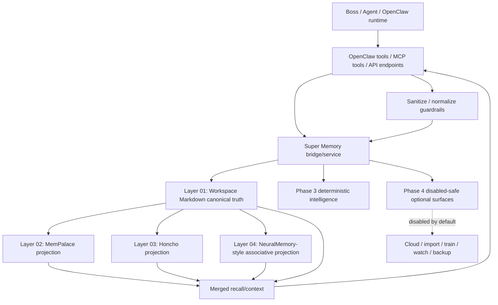
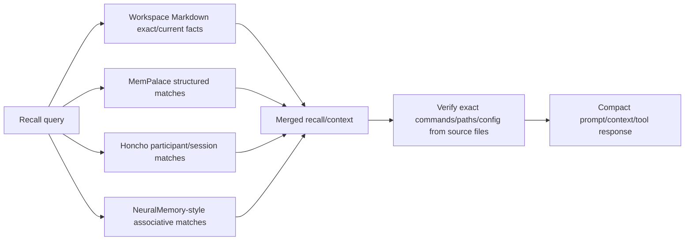

# Super Memory Layers, Tools, Connections, and Cooperation Report

Status: Phase 5 / sandbox-qualified development candidate  
Project: Super Memory  
Current reference commit when written: `a1a2b45 fix: harden sandbox openclaw plugin smoke`

## Executive summary

Super Memory is designed as a canonical-first memory orchestration layer for OpenClaw-style multi-agent work. It does not treat every storage backend as equal. The intended authority chain is deliberate:

1. **Workspace Markdown** is the canonical local truth.
2. **MemPalace** stores structured project/procedural memory as a downstream projection.
3. **Honcho** stores conversation/participant/session memory as a downstream projection.
4. **NeuralMemory-style layer** stores associative/graph-style recall as a downstream projection.
5. **OpenClaw plugin, MCP server, and HTTP API** expose those layers to agents and runtime workflows without making derived layers more authoritative than canonical markdown.

The core invariant is: if canonical Workspace Markdown save fails while `require_canonical_first=true`, downstream writes must be skipped so derived stores never become the only source of truth.

## System map



## Layer roles

### Layer 01 — Workspace Markdown

Role: canonical local truth.

Responsibilities:

- Append durable events/results to `memory/YYYY-MM-DD.md`.
- Preserve exact provenance and lane/session context.
- Promote stable long-term orientation to `MEMORY.md` when appropriate.
- Promote doctrine, preferences, blockers, and workflows to `memory/registers/` when appropriate.
- Remain the source that other layers derive from, not the other way around.

Best for:

- Exact durable facts.
- Decisions and workflow changes.
- Human-verifiable local history.
- Source-of-truth continuity for OpenClaw agents.

Failure rule:

- If Workspace Markdown write fails and canonical-first mode is required, downstream projections are skipped.

### Layer 02 — MemPalace

Role: structured procedural/project memory projection.

Responsibilities:

- Store memories in structured drawers/chambers/rooms style metadata.
- Preserve project/task/procedure organization.
- Support local deterministic recall over structured memory.

Best for:

- Project rooms.
- Task chambers.
- Workflows and procedures.
- Self-improvement lessons.
- Agent-specific working memory.

Cooperation with other layers:

- Receives canonical memory after Workspace Markdown succeeds.
- Feeds merged recall/context views.
- Should not overwrite canonical markdown by itself.

### Layer 03 — Honcho

Role: conversational/session/participant memory projection.

Responsibilities:

- Store participant/session/turn-like memory.
- Preserve peer profile facts and conversation state.
- Support multi-agent conversational continuity.

Best for:

- Boss preferences and participant facts.
- Dialogue-derived state.
- Session continuity.
- Multi-agent observer/observed records.

Cooperation with other layers:

- Receives relevant memories after canonical save succeeds.
- Helps recall who said what, in which session, and with what participant context.
- Should not become the canonical store for durable project truth.

### Layer 04 — NeuralMemory-style associative layer

Role: associative/graph-style recall projection.

Responsibilities:

- Store typed memories for associative search.
- Preserve links useful for cross-time recall.
- Support blocker/workflow/insight recall and graph-like explanations.

Best for:

- Cross-time patterns.
- Repeated blockers.
- Workflows and lessons.
- Hypothesis-like or insight-like memory.
- Semantic/associative recall.

Cooperation with other layers:

- Receives distilled memories after canonical save succeeds.
- Feeds merged recall/prefetch/context.
- Can later cooperate with real NeuralMemory MCP/local APIs, but should remain downstream unless doctrine changes.

## Tool surfaces

Super Memory exposes the same underlying bridge through three operator-facing surfaces:

1. OpenClaw plugin tools.
2. MCP stdio tools.
3. HTTP API endpoints.

### OpenClaw plugin tools

Current OpenClaw plugin tool contract includes:

- `super_memory_mcp_tools_list`
- `memory_search`
- `memory_get`
- `super_memory_remember`
- `super_memory_recall`
- `super_memory_search_compatible`
- `super_memory_get_compatible`
- `super_memory_prefetch`
- `super_memory_sync_turn`
- `super_memory_promote`
- `super_memory_status`

Important guardrails:

- `memory_search` and `memory_get` are compatibility shims for exclusive-slot testing.
- Legacy shims are gated by config and disabled by default unless explicitly enabled.
- Plugin register must stay synchronous for OpenClaw loader compatibility.
- `openclaw.plugin.json` must keep `contracts.tools` in sync with runtime `api.registerTool(...)` calls.

### MCP server tools

The MCP server provides profile-based exposure:

- `normal`: safe daily tools.
- `admin`: normal tools plus promotion/admin actions.
- `all`: every implemented tool, including Phase 3/4 surfaces.

Normal-profile capabilities include:

- remember
- remember-batch
- show
- context
- todo
- auto
- stats
- health
- sanitize-prompt
- sanitize-auto-capture
- normalize-memory
- recall
- prefetch
- sync-turn
- memory-search-compatible
- memory-get-compatible
- status

Admin/all profiles add broader structural tools such as promotion, Phase 3 intelligence, and disabled-safe optional skeletons.

MCP resources:

- `super-memory://status`

### HTTP API endpoints

Health and status:

- `GET /health`
- `GET /status`
- `GET /stats`
- `GET /memory-health`
- `GET /mcp-tools`

Core memory:

- `POST /remember`
- `POST /remember-batch`
- `POST /show`
- `POST /context`
- `POST /todo`
- `POST /auto`
- `POST /recall`
- `POST /memory-search`
- `POST /memory-get`
- `POST /prefetch`
- `POST /sync-turn`
- `POST /promote`

Sanitization and normalization:

- `POST /sanitize-prompt`
- `POST /sanitize-auto-capture`
- `POST /normalize-memory`

Phase 3 deterministic intelligence:

- `POST /conflicts`
- `POST /provenance`
- `POST /source`
- `POST /version`
- `POST /pin`
- `POST /consolidate`
- `POST /gaps`
- `POST /explain`
- `GET /situation`
- `POST /reflex`
- `POST /boundaries`

Phase 4 disabled-safe optional surface:

- `POST /optional/{action}`

Phase 4 optional actions are intentionally disabled by default and must not start daemons, sync cloud data, import documents, upload backups, or watch directories unless explicitly configured later.

## Save workflow

```mermaid
sequenceDiagram
  participant Agent as Agent/OpenClaw/MCP/API caller
  participant San as Sanitize/Normalize
  participant Bridge as Super Memory Bridge
  participant MD as Workspace Markdown
  participant MP as MemPalace
  participant HC as Honcho
  participant NM as NeuralMemory-style

  Agent->>San: memory payload / turn / auto-capture text
  San->>Bridge: normalized MemoryRecord
  Bridge->>MD: append canonical memory
  alt canonical save succeeds
    Bridge->>MP: write structured projection
    Bridge->>HC: write conversation/session projection
    Bridge->>NM: write associative projection
    Bridge-->>Agent: per-layer result with provenance
  else canonical save fails and canonical-first required
    Bridge-->>Agent: failure; downstream skipped
  end
```

Save order:

1. Normalize and sanitize input.
2. Write canonical Workspace Markdown.
3. Write MemPalace projection.
4. Write Honcho projection.
5. Write NeuralMemory-style projection.
6. Return per-layer results and provenance.

This workflow prevents derived stores from drifting ahead of canonical truth.

## Recall workflow



Recall order recommendation:

1. Use canonical markdown / `memory_search` / `memory_get` for exact current facts.
2. Use Super Memory merged recall for derived context.
3. Verify exact paths, commands, config keys, and quoted text from source files before acting.
4. Inject only compact, cited context into prompts.

## Cooperation between layers

### Canonical-first cooperation

Workspace Markdown controls authority. Other layers cooperate by adding different retrieval shapes, not by replacing canonical truth.

- Markdown answers: what exactly happened and where it was recorded.
- MemPalace answers: what room/project/procedure does this belong to.
- Honcho answers: who/which session/which conversation context matters.
- NeuralMemory-style answers: what this relates to across time and concepts.

### Sanitization cooperation

Sanitization sits before save and auto-capture:

- Redacts common secret shapes.
- Normalizes whitespace/control characters.
- Folds schema aliases such as `agentId` to `agent_id`.
- Normalizes type/scope/tags.
- Clamps trust score.
- Moves unknown top-level fields into `metadata.dropped_fields` for audit.

This keeps all layers safer and more consistent.

### MCP/OpenClaw cooperation

The OpenClaw plugin can expose Super Memory without forcing runtime replacement:

- Normal mode: Super Memory tools are additive.
- Exclusive-slot test mode: guarded `memory_search` / `memory_get` compatibility shims can be enabled.
- Dynamic MCP proxy: OpenClaw can inspect available MCP tools via `/mcp-tools`.
- Hook skeletons: pre-prompt/post-agent/pre-compaction/reset/startup hooks exist behind explicit config, but should remain disabled until live OpenClaw hook APIs are validated.

### Phase 3 cooperation

Phase 3 intelligence tools add audit and structure without silently rewriting canonical memory:

- conflicts: identify or record conflict-like events.
- provenance/source: track where memory came from.
- version/schema: track versions and changes.
- pin/reflex/boundaries: mark high-priority or always-on memory concepts.
- consolidate/gaps/explain/situation: provide safe summaries and diagnostic views.

These are deterministic baseline surfaces now; model-backed reasoning can be added later behind explicit configuration.

### Phase 4 cooperation

Phase 4 optional tools are placeholders for heavy operations:

- train/import/index
- cloud sync
- Telegram backup
- visualize
- store/community brain
- watch daemon

They cooperate with the system by refusing unsafe work by default. They should only become active when the operator explicitly configures credentials, scope, storage, and safety rules.

## Current verification status

Current verified state:

- Local repo verification passed with `pytest -q`: 29 tests passed.
- OpenSandbox smoke passed with sandbox-local OpenClaw install.
- OpenClaw plugin doctor reported no plugin issues after hardening.
- Plugin manifest now declares `contracts.tools`.
- Plugin register is synchronous for OpenClaw loader compatibility.

Known non-production areas:

- Full gateway live-run / real agent-turn behavior still needs a clean supervised test.
- OpenClaw hook names and payload contracts need validation before enabling hook skeletons.
- Phase 3 intelligence is deterministic baseline, not full neural/cognitive reasoning.
- Phase 4 heavy workflows are disabled-safe stubs.
- Super Memory API is currently a sidecar process; production lifecycle management is not finalized.

## Recommended next steps

1. Add a supervised gateway runtime smoke test that verifies plugin runtime load inside an actual running OpenClaw gateway.
2. Validate hook skeleton names and payloads against live OpenClaw hook APIs before enabling `registerSuperMemoryHooks`.
3. Add lifecycle management for the Super Memory API sidecar.
4. Add stronger parity mapping with upstream NeuralMemory MCP tools where it fits Super Memory's canonical-first doctrine.
5. Keep Phase 4 heavy workflows disabled until each has explicit credentials, scope, and rollback rules.

## Bottom line

Super Memory is best understood as a canonical-first memory coordinator. Its layers cooperate by specializing in different memory shapes while preserving a single authority chain. Workspace Markdown remains the truth; MemPalace, Honcho, and NeuralMemory-style layers enrich recall; OpenClaw/MCP/API surfaces expose the system safely to agents and tools.
